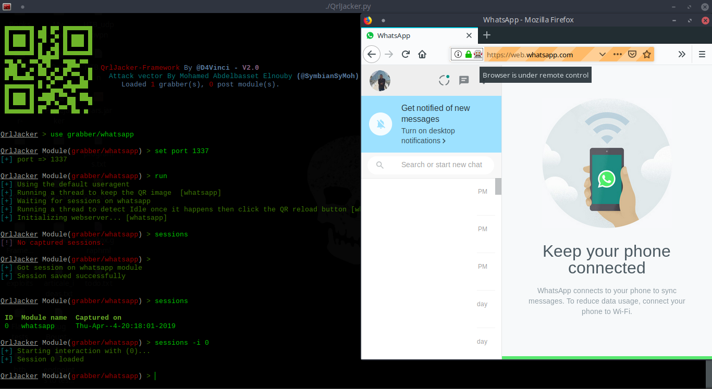

# QRLJacker - QRLJacking Exploitation Framework 
### QRLJacker is a highly customizable exploitation framework to demonstrate "[QRLJacking Attack Vector](https://www.owasp.org/index.php/Qrljacking)" to show how it is easy to hijack services that depend on QR Code as an authentication and login method, Mainly it aims to raise the security awareness regarding all the services using the QR Code as a main way to login users to different services!

## Screenshot

[Youtube Tutorial for installing and running it](https://www.youtube.com/watch?v=sYtH5-K2JZc)

## Prerequisites before installing:
1. Linux or MacOS. (Not working on windows)
2. Python 3.7+

## Installing instructions:
> Note: Don't install QRLJacker and Firefox as root in a regular user's session because it's not supported by Firefox which would give error on running modules in framework.

***Important note: If you have multiple python version, use `python3.7` command instead of `python3` in the following steps and use `python3.7 -m pip` instead of `pip`, `pip3` or even `python3 -m pip` because that's the reason of 95% of the issues opened here. I think people often skip the important parts :smile:***

1. Update Firefox browser to the latest version
2. Install the latest geckodriver from https://github.com/mozilla/geckodriver/releases and extract the file then do :
	* `chmod +x geckodriver`
	* `sudo mv -f geckodriver /usr/local/share/geckodriver`
	* `sudo ln -s /usr/local/share/geckodriver /usr/local/bin/geckodriver`
	* `sudo ln -s /usr/local/share/geckodriver /usr/bin/geckodriver`
3. Clone the repo with `git clone https://github.com/OWASP/QRLJacking` then do `cd QRLJacking/QRLJacker`
4. Install all the requirements with `pip install -r requirements.txt`
5. Now you can run the framework with `python3 QrlJacker.py --help`

## Tested on
- Ubuntu 18.04 Bionic Beaver
- Kali Linux 2018.x and up

## Usage
### Commandline arguments
```
usage: QrlJacker.py [-h] [-r ] [-x ] [--debug] [--dev] [--verbose] [-q]

optional arguments:
  -h, --help  show this help message and exit
  -r          Execute a resource file (history file).
  -x          Execute a specific command (use ; for multiples).
  --debug     Enables debug mode (Identifying problems easier).
  --dev       Enables development mode (Reloading modules every use).
  --verbose   Enables verbose mode (Display more details).
  -q          Quit mode (no banner).
```
### Main menu help
```
General commands
=================
	Command               Description
	---------             -------------
	help/?                Show this help menu.
	os      <command>     Execute a system command without closing the framework
	banner                Display banner.
	exit/quit             Exit the framework.

Core commands
=============
	Command               Description
	---------             -------------
	database              Prints the core version, check if framework is up-to-date and update if you are not up-to-date.
	debug                 Drop into debug mode or disable it. (Making identifying problems easier)
	dev                   Drop into development mode or disable it. (Reload modules every use)
	verbose               Drop into verbose mode or disable it. (Make framework displays more details)
	reload/refresh        Reload the modules database.

Resources commands
==================
	Command               Description
	---------             -------------
	history               Display commandline most important history from the beginning.
	makerc                Save the most important commands entered since start to a file.
	resource  <file>      Run the commands stored in a file.

Sessions management commands
============================
	Command               Description
	---------             -------------
	sessions (-h)         Dump session listings and display information about sessions.
	jobs     (-h)         Displays and manages jobs.

Module commands
===============
	Command               Description
	---------             -------------
	list/show             List modules you can use.
	use      <module>     Use an available module.
	info     <module>     Get information about an available module.
	previous              Runs the previously loaded module.
	search   <text>       Search for a module by a specific text in its name or in its description.
```
### Module menu help
```
General commands
=================
	Command               Description
	---------             -------------
	help/?                Show this help menu.
	os      <command>     Execute a system command without closing the framework
	banner                Display banner.
	exit/quit             Exit the framework.

Core commands
=============
	Command               Description
	---------             -------------
	database              Prints the core version and then check if it's up-to-date.
	debug                 Drop into debug mode or disable it. (Making identifying problems easier)
	dev                   Drop into development mode or disable it. (Reload modules every use)
	verbose               Drop into verbose mode or disable it. (Make framework displays more details)
	reload/refresh        Reload the modules database.

Resources commands
==================
	Command               Description
	---------             -------------
	history               Display commandline most important history from the beginning.
	makerc                Save the most important commands entered since start to a file.
	resource  <file>      Run the commands stored in a file.

Sessions management commands
============================
	Command               Description
	---------             -------------
	sessions (-h)         Dump session listings and display information about sessions.
	jobs     (-h)         Displays and manages jobs.

Module commands
===============
	Command               Description
	----------            --------------
	list/show             List modules you can use.
	options               Displays options for the current module.
	set                   Sets a context-specific variable to a value.
	run                   Launch the current module.
	use     <module>      Use an available module.
	info    <module>      Get information about an available module.
	search  <text>        Search for a module by a specific text in its name or in its description.
	previous              Sets the previously loaded module as the current module.
	back                  Move back from the current context.
```
### Sessions command help menu
```
usage: sessions [-h] [-l] [-K] [-s] [-k] [-i]

optional arguments:
  -h   Show this help message.
  -l   List all captured sessions.
  -K   Remove all captured sessions.
  -s   Search for sessions with a specifed type.
  -k   Remove a specifed captured session by ID
  -i   Interact with a captured session by ID.
```
### Jobs command help menu
```
usage: jobs [-h] [-l] [-K] [-k]

optional arguments:
  -h   Show this help message.
  -l   List all running jobs.
  -K   Terminate all running jobs.
  -k   Terminate jobs by job ID or module name
```

## Taking advantage of the core
### Commands autocomplete
The autocomplete feature that has been implemented in this framework is not the usual one you always see, here are some highlights:

1. It's designed to fix typos in typed commands to the most similar command with just one tab click so `saerch` becomes `search` and so on, even if you typed any random word similar to an command in this framework.

2. For you lazy-ones out there like me, it can predict what module you are trying to use by typing any part of it. For example if you typed `use wh` and clicked tab, it would be replaced with `use grabber/whatsapp` and so on. I can see your smile, You are welcome!

3. If you typed any wrong command then pressed enter, the framework will tell you what is the nearest command to what you have typed which could be the one you really wanted.

4. Some less impressive things like autocomplete for options of the current module after `set` command, autocomplete for modules after `use` and `info` commands and finally it converts all uppercase to lowercase automatically just-in-case you switched cases by mistake while typing.

5. Finally, you'll find your normal autocopmletion things you were using before, like commands autocompletion and persistent history, etc...


## Automation
- As you may noticed, you can use a resource file from command-line arguments before starting the framework itself or send commands directly.
- Inside the framework you can use `makerc` command like in Metasploit but this time it only saves the correct important commands.
- There are `history` and `resource` commands so you don't need to exit the framework.
- You can execute as many commands as you want at the same time by splitting them with semi-colon and many more left to be discovered by yourself.
- Searching for modules in QRLJacker is so easy, you can search for a module by its name, something written in its description or even the author name.

## Framework Maintainers
- [@melbadry9](https://github.com/melbadry9)
- [@samm0uda](https://github.com/samm0uda)
- [@Lekssays](https://github.com/Lekssays)
- [@0xGuindi](https://github.com/0xGuindi)
- [@Kiro24](https://github.com/Kiro24)
- [@MohamedAbdultawab](https://github.com/MohamedAbdultawab)
- [@mohmyo](https://github.com/mohmyo)
- [@OmarMerghany](https://github.com/OmarMerghany)
- [@TheRubick](https://github.com/TheRubick)
- [@mikeashi](https://github.com/mikeashi)
- [@mxfoxawy](https://github.com/xfoxawy)

## Reporting an issue
- Before reporting an issue, activate the debug mode by using the `debug` command or the debug commandline argument and once the error happens again, the framework will print the error trace-back. Also debug mode activates some hidden commands which will help us in debugging the error and fix the problem for you.
- Finally, make sure when reporting the issue to provide the very basic info like your system, python version and the output from the debugging mode.

## Development
If you want to write your own module, read [the development docs from here](docs/README.md)

## Future ToDos:
1. Write modules for other websites and services.
2. Write post-exploitation modules for the framework.
3. TBD

## OWASP's links reference
https://www.owasp.org/index.php/QRLJacking

https://www.owasp.org/index.php/OWASP_QRLJacker
